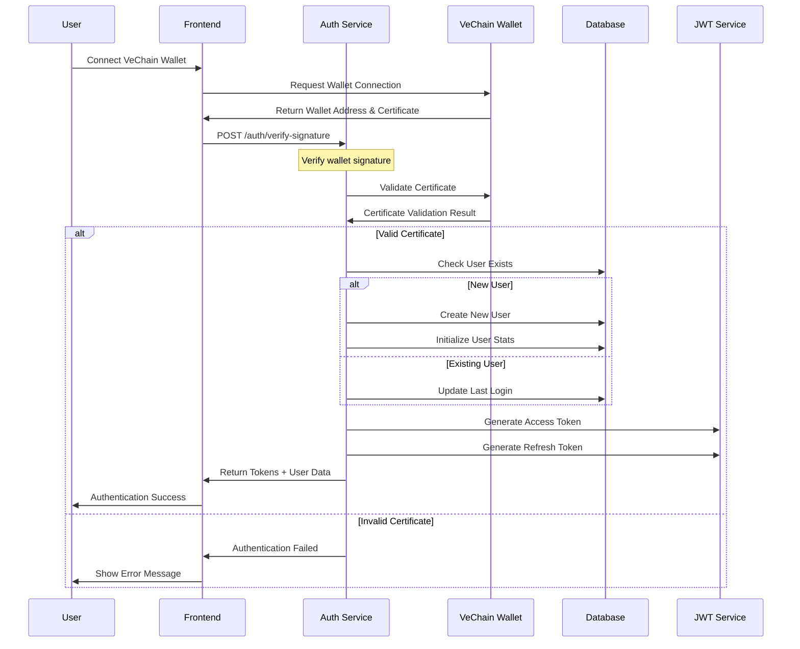
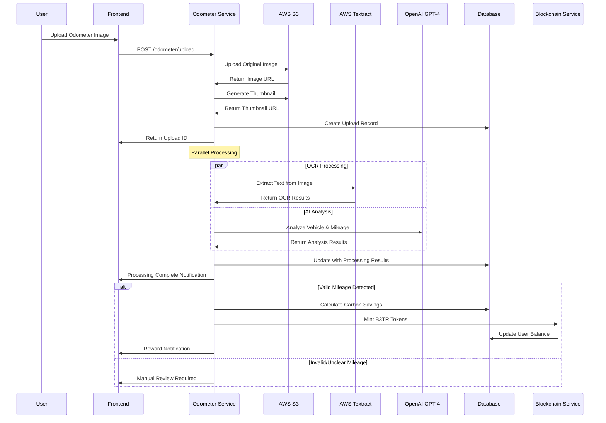
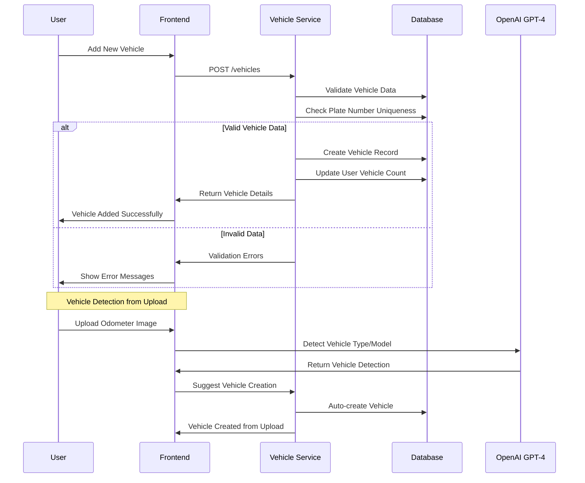
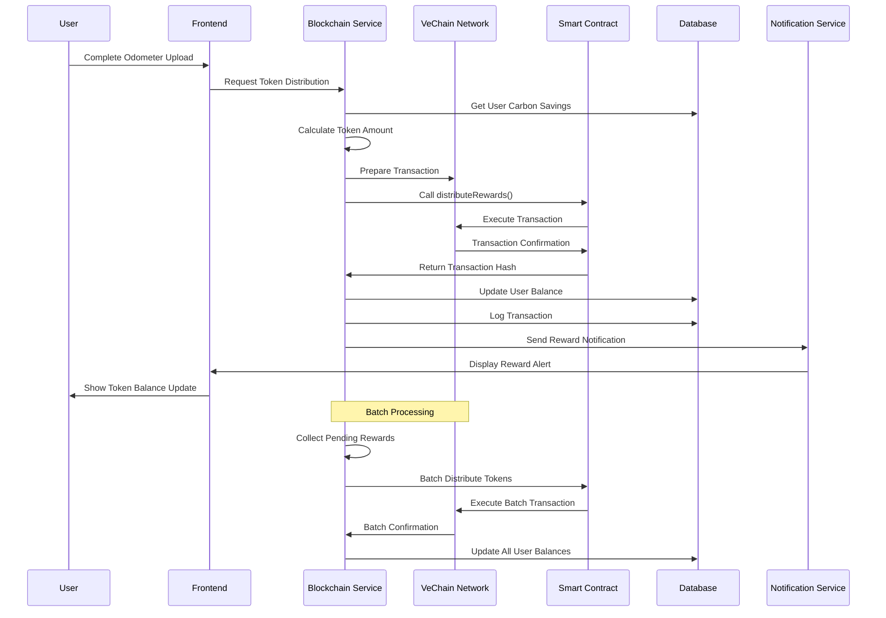
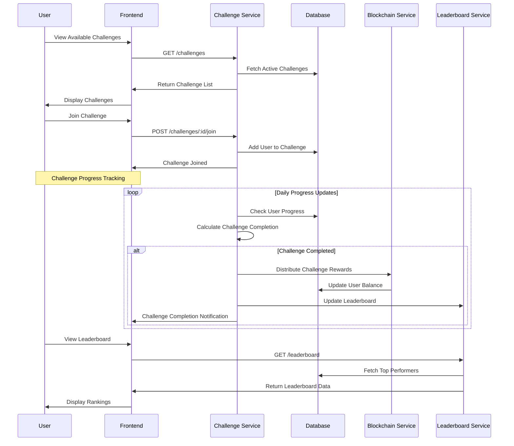
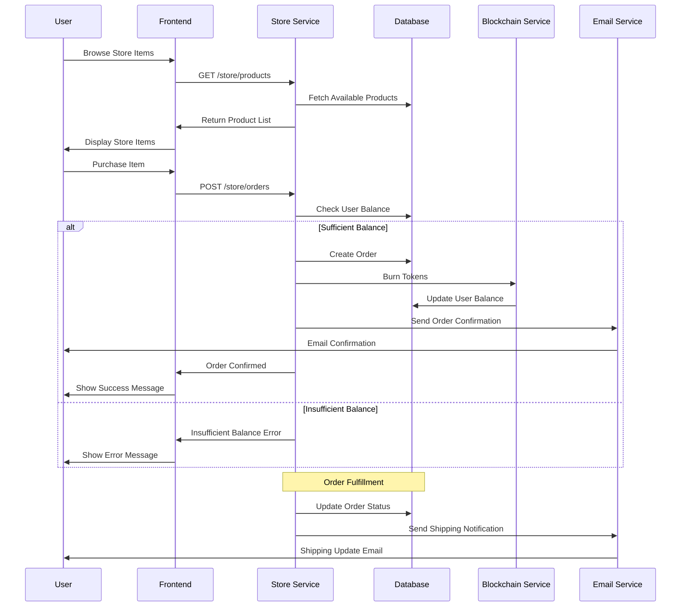
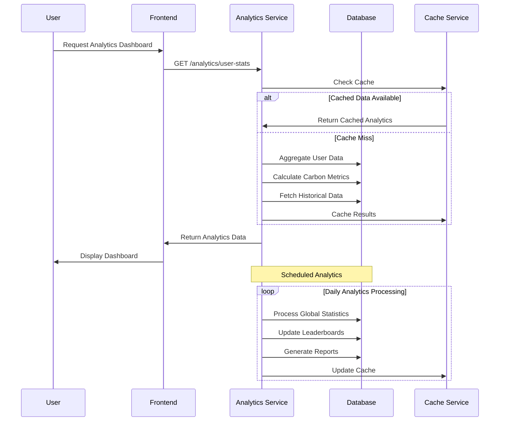
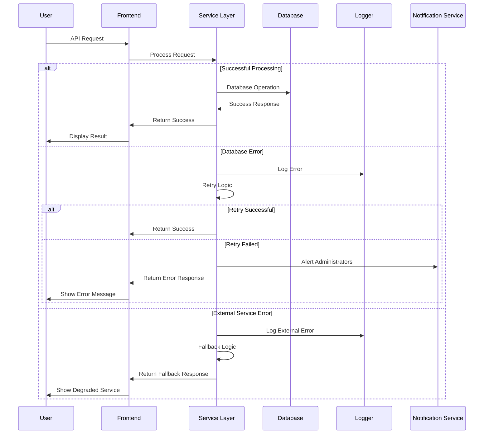

# Detailed Project Workflow

## Overview

The Drive & Earn platform operates through several interconnected workflows that enable users to earn B3TR tokens by documenting their eco-friendly driving activities. This document outlines the key user journeys and system interactions.

## 1. User Authentication Workflow

### Sequence Diagram

### Narrative Explanation

The authentication workflow begins when a user connects their VeChain wallet to the application. The system verifies the wallet's digital signature using VeChain's certificate system, ensuring the user owns the wallet address. If valid, the system either creates a new user account or authenticates an existing user, generating JWT tokens for secure API access.

**Critical Decision Points:**

- Wallet certificate validation
- New vs. existing user handling
- Token generation and security

## 2. Odometer Upload & Processing Workflow

### Sequence Diagram

### Narrative Explanation

The odometer upload workflow is the core process of the platform. Users upload photos of their vehicle's odometer, which triggers parallel processing through AWS Textract for OCR and OpenAI GPT-4 for intelligent analysis. The system validates the mileage, calculates carbon savings, and automatically mints B3TR tokens to the user's wallet.

**Critical Decision Points:**

- Image quality assessment
- Mileage validation and confidence scoring
- Carbon savings calculation
- Token distribution logic

## 3. Vehicle Management Workflow

### Sequence Diagram

### Narrative Explanation

The vehicle management workflow allows users to register and manage their vehicles. The system supports both manual vehicle registration and automatic vehicle detection from odometer uploads. Each vehicle is associated with emission factors that determine carbon savings calculations.

**Critical Decision Points:**

- Vehicle data validation
- Plate number uniqueness checking
- Automatic vehicle detection from images
- Emission factor assignment

## 4. Token Distribution & Blockchain Workflow

### Sequence Diagram

### Narrative Explanation

The blockchain workflow handles the distribution of B3TR tokens based on verified carbon savings. The system uses VeChain's smart contracts to ensure transparent and immutable token distribution. Transactions are batched for efficiency and cost-effectiveness.

**Critical Decision Points:**

- Token calculation algorithms
- Transaction batching decisions
- Gas fee optimization
- Transaction confirmation handling

## 5. Challenge & Gamification Workflow

### Sequence Diagram

### Narrative Explanation

The gamification workflow creates engaging challenges that encourage sustainable driving habits. Users can join various challenges, track their progress, and compete on leaderboards. Successful challenge completion triggers additional token rewards.

**Critical Decision Points:**

- Challenge difficulty balancing
- Progress tracking algorithms
- Reward distribution timing
- Leaderboard ranking calculations

## 6. Store & Token Redemption Workflow

### Sequence Diagram

### Narrative Explanation

The store workflow allows users to redeem their B3TR tokens for real-world rewards and products. The system validates token balances, processes orders, and manages the token burning process to maintain token economics.

**Critical Decision Points:**

- Token balance validation
- Order processing logic
- Token burning mechanisms
- Fulfillment tracking

## 7. Analytics & Reporting Workflow

### Sequence Diagram

### Narrative Explanation

The analytics workflow provides users with comprehensive insights into their driving patterns, carbon savings, and token earnings. The system uses caching to optimize performance and processes global statistics on a scheduled basis.

**Critical Decision Points:**

- Data aggregation strategies
- Cache invalidation policies
- Real-time vs. batch processing
- Performance optimization

## 8. Error Handling & Recovery Workflow

### Sequence Diagram

### Narrative Explanation

The error handling workflow ensures system reliability and graceful degradation when issues occur. The system implements retry logic, fallback mechanisms, and comprehensive logging to maintain service quality.

**Critical Decision Points:**

- Retry strategy configuration
- Fallback service selection
- Error notification thresholds
- Graceful degradation policies

## Key Workflow Characteristics

### Performance Considerations

- **Parallel Processing**: OCR and AI analysis run concurrently
- **Caching Strategy**: Redis caching for frequently accessed data
- **Batch Operations**: Blockchain transactions are batched for efficiency
- **Async Processing**: Non-critical operations use background processing

### Security Measures

- **JWT Authentication**: Secure token-based authentication
- **Rate Limiting**: Protection against API abuse
- **Input Validation**: Comprehensive validation at all entry points
- **Blockchain Security**: Immutable transaction records

### Scalability Features

- **Modular Architecture**: Independent service modules
- **Database Optimization**: Proper indexing and query optimization
- **Load Balancing**: Support for horizontal scaling
- **Microservices Ready**: Architecture supports service decomposition

This workflow documentation provides a comprehensive understanding of how the Drive & Earn platform operates, enabling stakeholders to understand the system's complexity and identify potential areas for optimization or enhancement.
