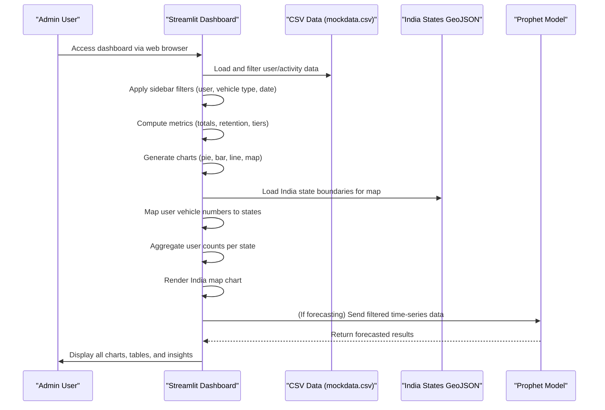

# Drive & Earn Analytics Dashboard

_Comprehensive Project Documentation_

---

## 1. Project Overview

The **Drive & Earn Analytics Dashboard** is an interactive analytics platform designed to empower administrators with deep insights into user engagement, vehicle activity, and operational trends. Built for clarity, scalability, and extensibility, this dashboard transforms raw mobility data into actionable intelligence—enabling data-driven decisions and strategic growth.

---

## 2. Technology Stack

| Category      | Technology      | Version | Purpose                                                                          |
| ------------- | --------------- | ------- | -------------------------------------------------------------------------------- |
| Backend       | Python          | 3.10+   | Core programming language for all backend logic, data processing, and analytics. |
| Web Framework | Streamlit       | 1.25.0+ | Rapidly builds interactive, data-driven web dashboards with minimal boilerplate. |
| Visualization | Plotly          | 5.5.0+  | Creates interactive, visually appealing charts and maps for data exploration.    |
| Data Science  | Pandas          | 1.3.0+  | Efficient data manipulation, filtering, and aggregation for analytics workflows. |
| Forecasting   | Prophet         | 1.0+    | Time-series forecasting for predicting future trends (e.g., user activity).      |
| Data Storage  | CSV             | N/A     | Stores mock user and activity data for demonstration and analytics.              |
| Geospatial    | GeoJSON         | N/A     | Provides India state boundaries for map visualizations.                          |
| Deployment    | Streamlit Cloud | N/A     | (Optional) For hosting and sharing the dashboard online.                         |
| Utilities     | NumPy           | 1.21.0+ | Numerical operations and support for data science workflows.                     |

> **Note:** A well-structured CSV file is used to simulate real-world scenarios, enabling the dashboard to demonstrate edge cases and predictive insights effectively.

---

## 3. End-to-End Workflow

### 3.1. Sequence Diagram



### 3.2. Chart-by-Chart Explanation

| Section           | Chart Name                  | Logic & Meaning                                                                       | Use Case / Value                                                                |
| ----------------- | --------------------------- | ------------------------------------------------------------------------------------- | ------------------------------------------------------------------------------- |
| Overall Insights  | Metric Cards                | Show key KPIs (total users, active users, uploads, distance, etc.)                    | Quick snapshot of platform health and engagement                                |
| Overall Insights  | User Tier Pie Chart         | Categorizes users into tiers based on activity thresholds (distance, uploads)         | Visualizes user engagement and incentivizes higher activity                     |
| Overall Insights  | Vehicle Type Pie Chart      | Distribution of users by vehicle type                                                 | Understands fleet composition and user preferences                              |
| Overall Insights  | India Map                   | Maps users (with valid vehicle numbers) to Indian states, showing spread and density  | Identifies regional adoption, market penetration, and growth opportunities      |
| Overall Insights  | Users Without Vehicle Table | Lists users missing vehicle info, with status and details                             | Data quality check, targets for user outreach or onboarding                     |
| Overall Insights  | Submission Analytics        | Time-series and bar charts of uploads, activity, and retention                        | Tracks platform usage trends, identifies peak periods, and monitors retention   |
| Overall Insights  | Anomaly Detection Panel     | Highlights unusual spikes, drops, or outliers in platform activity                    | Early detection of operational issues or unexpected user behavior               |
| Overall Insights  | Forecasting (Prophet)       | Predicts future activity based on historical data                                     | Supports planning, resource allocation, and growth projections                  |
| Overall Insights  | Retention Analysis          | Analyzes user retention, churn, and reactivation over time                            | Measures platform stickiness and informs retention strategies                   |
| Per User Insights | Basic Details               | Displays user’s name, wallet ID, vehicle type, and registration info                  | Provides context for individual user analysis                                   |
| Per User Insights | Metric Cards                | Individual KPIs for each user (total distance, uploads, last activity, etc.)          | Enables granular tracking of user performance and engagement                    |
| Per User Insights | Spike Detection             | Highlights unusual activity, gaps, or spikes for the user                             | Early detection of issues or opportunities for intervention                     |
| Per User Insights | Tier Level                  | Shows the user’s current tier, progress bar, and what’s needed to reach the next tier | Motivates users, supports gamification, and helps identify top performers       |
| Per User Insights | Badges Earned               | Displays badges or achievements unlocked by the user                                  | Recognizes milestones, encourages continued engagement, and gamifies experience |
| Per User Insights | User Activity and Trends    | Visualizes the user’s activity timeline, tokens earned, and battery trends over time  | Detects engagement patterns, drop-offs, and reactivation opportunities          |

**Narrative:**  
The dashboard provides both organization-wide analytics and deep per-user insights. Admins can monitor platform health, spot trends, and drill down into individual user journeys. This dual perspective makes it easy to identify top performers, at-risk users, and opportunities for personalized outreach or platform improvement.

---

## 4. Modular Architecture Overview

### 4.1. High-Level Block Diagram

```
+-------------------+
|   Admin User      |
+--------+----------+
         |
         v
+--------+----------+
| Streamlit Frontend|
+--------+----------+
         |
         v
+--------+----------+      +-------------------+
| Data Processing   |<---->|   mockdata.csv    |
+--------+----------+      +-------------------+
         |
         v
+--------+----------+      +-------------------+
| Visualization     |<---->| india.states.geo.json |
+--------+----------+      +-------------------+
         |
         v
+--------+----------+
| Forecasting (Prophet) |
+-------------------+
```

### 4.2. Module Descriptions

#### 1. Streamlit Frontend

- **Responsibilities:**
  - Renders the dashboard UI and handles user interactions.
  - Provides sidebar filters for dynamic data exploration.
  - Displays all charts, tables, and metrics.
- **Key Dependencies:** Data Processing, Visualization

#### 2. Data Processing

- **Responsibilities:**
  - Loads and cleans data from CSV.
  - Applies filters (user, vehicle type, date).
  - Computes metrics, aggregates, and user tiers.
  - Maps vehicle numbers to states.
- **Key Dependencies:** mockdata.csv, Visualization, Forecasting

#### 3. Visualization

- **Responsibilities:**
  - Generates all charts (pie, bar, line, map) using Plotly.
  - Handles geospatial mapping with GeoJSON.
  - Styles charts for clarity and impact.
- **Key Dependencies:** Data Processing, india.states.geo.json

#### 4. Forecasting (Prophet)

- **Responsibilities:**
  - Receives filtered time-series data.
  - Trains and applies Prophet model for forecasting.
  - Returns predictions to the dashboard.
- **Key Dependencies:** Data Processing

#### 5. Data Sources

- **mockdata.csv:** Stores all user and activity data.
- **india.states.geo.json:** Provides state boundaries for map visualizations.

---

## 5. AI and External Services Integration

### Prophet (AI/ML Forecasting)

- **Service Name:** Prophet (Facebook Prophet)
- **Purpose:**  
  To forecast future user activity (e.g., upcoming users, uploads, distance driven) based on historical trends, enabling proactive business planning.
- **Integration Points:**
  - Invoked from the Data Processing module when the admin requests forecasting.
  - Receives filtered time-series data (date, metric).
- **Data Exchange:**
  - **Input:** DataFrame with date and metric columns (e.g., uploads per day).
  - **Output:** DataFrame with forecasted values and confidence intervals.
- **Authentication/Authorization:**
  - Runs locally within the dashboard environment; no external API calls or credentials required.

### GeoJSON (External Data)

- **Service Name:** India States GeoJSON
- **Purpose:**  
  Provides accurate state boundaries for geospatial mapping of user distribution.
- **Integration Points:**
  - Loaded by the Visualization module when rendering the India map chart.
- **Data Exchange:**
  - **Input:** None (read-only file).
  - **Output:** Used as a reference for mapping user data to states.
- **Authentication/Authorization:**
  - Local file; no authentication required.

---

## 6. Final Notes

This dashboard is not just a reporting tool—it’s a **strategic asset** for the organization.  
It combines robust analytics, predictive intelligence, and a visually compelling interface, all built with best practices in modularity and extensibility.
